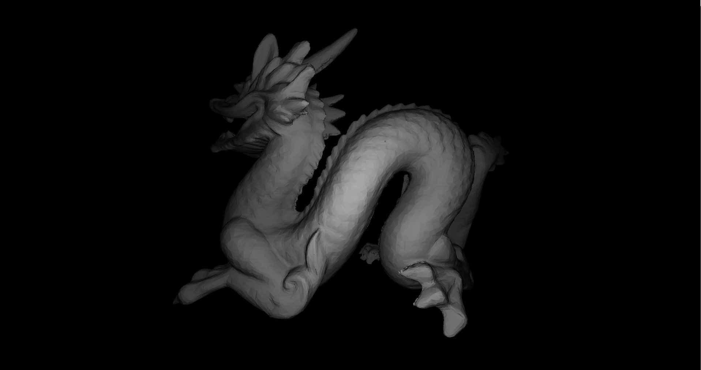
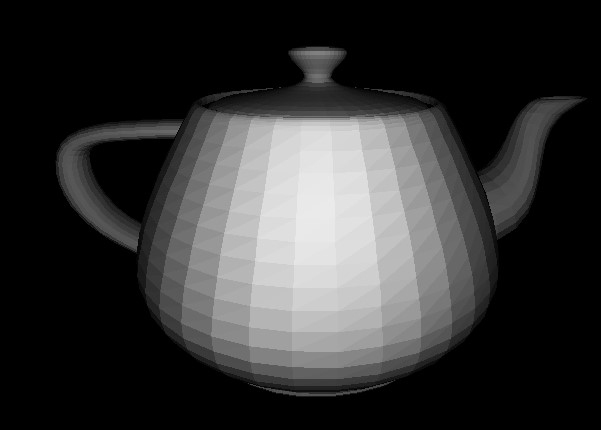

# 3D Java Renderer

## The Goal

This project's goal is to build a simple 3D java rendering engine from stratch.

## Features

+ **A Perspective Matrix**
  + *Ajustable Fov, zNear and zFar*
+ **Object Rotation Matrix**
  + *Ajustable Rotation and its center*
+ **Basic Camera**
  + *Movement*
  + *Rotation*
+ **Simple Lighting**
  + *Multiple Point Lights*
  + *Considers Distance (with the inverse square law)*
  + *Pixel Per Pixel Lighting*
+ **Other**
  + *Each of the triangle's vertices can have different colors (with smooth transitions)*
  ° *Model Loader*

## Thanks to these people for their algorithms and helpful resources

+ **Triangle Interpelation (color)**
  + [Link](https://codeplea.com/triangular-interpolation)
+ **Triangle 2D Rendering**
  + [Link](https://github.com/ssloy/tinyrenderer/wiki/Lesson-2:-Triangle-rasterization-and-back-face-culling)
+ **3D Rotation**
  + [Link](http://mathworld.wolfram.com/RotationMatrix.html)
+ **Projection Matrix**
  + [Link](https://www.scratchapixel.com/lessons/3d-basic-rendering/perspective-and-orthographic-projection-matrix/building-basic-perspective-projection-matrix)

## Todo List

+ **Lighting**
  + *Light Color*
+ **Performance**
  + *Triangle Cliping*
+ **Other**
  + *Use a better perspective matrix*
  + *Depth Buffer*
  
**And More To Come !**

## ScreenShots

### Teepot
 

  
### Bunny

