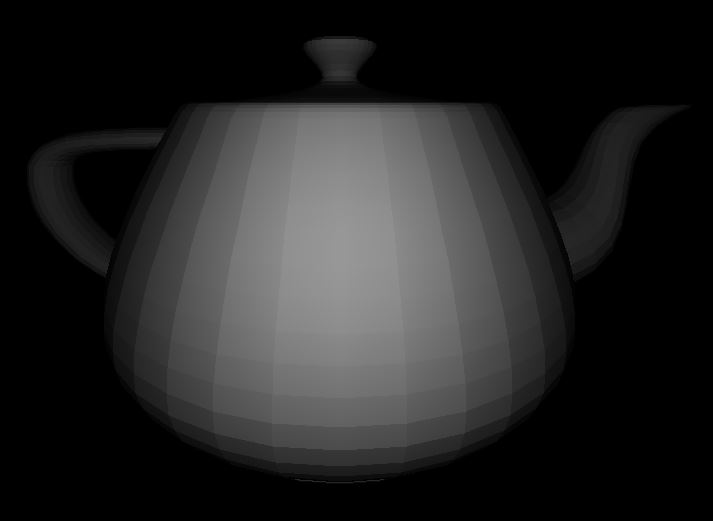

# 3D Java Renderer

## The Goal

This project's goal is to build a simple 3D java rendering engine from stratch.

## Features

+ **A Perspective Matrix**
  + *Ajustable Fov, zNear and zFar*
+ **Object Rotation Matrix**
  + *Ajustable Rotation and its center*
+ **Basic Camera**
  + *Movement*
  + *Rotation*
+ **Simple Lighting**
  + *Multiple Point Lights*
  + *Considers Distance (with the inverse square law)*

## Todo List

+ **Lighting**
  + *Light Color*
  + *Pixel Per Pixel Lighting*
  
**And More To Come !**

## ScreenShots

### Teepot
 

  
### Bunny

